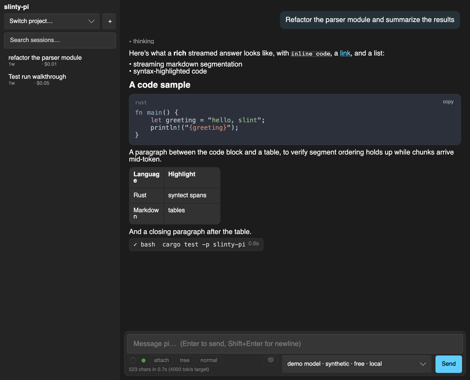
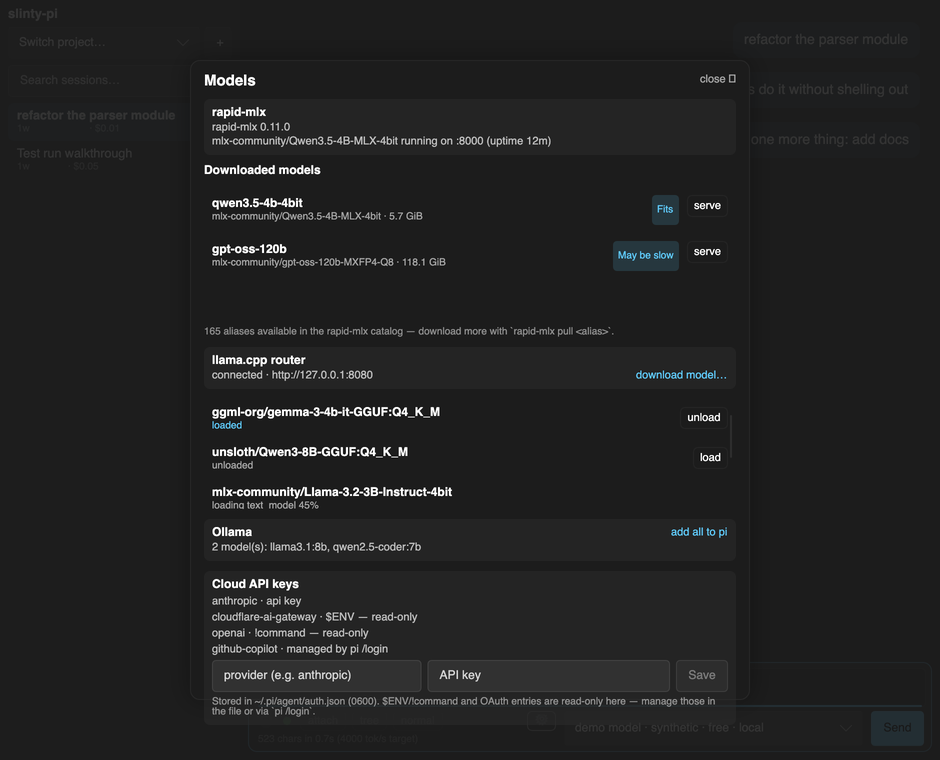
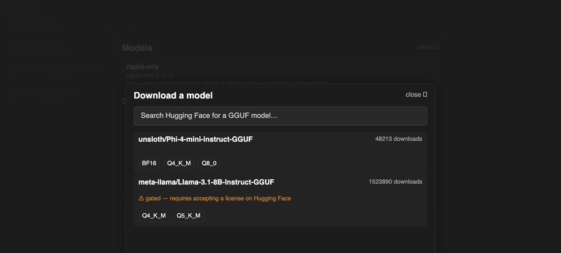

# slinty-pi

A native desktop frontend for the [pi coding agent](https://pi.dev), local-first: designed around
[rapid-mlx](https://rapidmlx.com) (Apple Silicon) and llama.cpp's router, with Ollama
detection/one-click setup and cloud providers through the same picker.

Two frontends share one Rust core: [`slint/slinty-pi`](slint/slinty-pi), a cross-platform app
built with [Slint](https://slint.dev) (this README), and [`macos/swifty-pi`](#swiftypi-native-macos),
a native SwiftUI app for macOS. Both drive the same `pi-core` orchestration logic rather than
duplicating it.

See [CLAUDE.md](CLAUDE.md) for architecture notes and the full list of env-var test hooks.

## Screenshots

| | |
|---|---|
|  Streaming markdown, syntax-highlighted code, tables, and tool-call chips in the transcript. |  One panel for every backend: rapid-mlx, the llama.cpp router, Ollama, and cloud API keys. |
|  Search and download GGUF models from Hugging Face without leaving the app. | |

Captured in [demo mode](#demo-mode-no-pi-needed) with synthetic data — no real model calls or Hugging Face queries.

## Crates

Shared core, used by both frontends:

- `crates/pi-rpc` — typed client for pi's RPC mode: spawns `pi --mode rpc`, strict-LF JSONL
  framing, request/response correlation, tolerant event deserialization, extension-UI replies.
- `crates/pi-sessions` — read-only index over pi's on-disk session JSONL tree, used for the
  sidebar and session-tree UI. pi remains the sole writer; this crate only ever reads.
- `crates/pi-local` — local-model backend foundation: rapid-mlx CLI integration, a llama.cpp
  router HTTP client, Hugging Face GGUF search, Ollama detection, `~/.pi/agent/{auth,models}.json`
  handling, and system RAM-fit estimation. Toolkit- and frontend-agnostic.
- `crates/pi-render` — stateless message/segment → row rendering: markdown segmentation, syntax
  highlighting, and session-history hydration into `RowSpec`s. Kept lean (no reqwest/sysinfo/
  directories) so it's cheap to pull into either frontend.
- `crates/pi-core` — UI-toolkit-agnostic core: drives `pi-rpc`, projects events onto rows,
  session/model orchestration. This is what `slint/slinty-pi` runs against directly.
- `crates/pi-core-ffi` — UniFFI boundary exposing `pi-core`'s session/model orchestration to
  Swift; generates the `PiCoreFFI.xcframework` + bindings that `macos/swifty-pi` links against.

Frontends:

- `slint/slinty-pi` — the Slint app (this README). Tokio backend owns the pi child process; all
  UI mutation goes through the Slint event loop with streaming deltas coalesced at ~33 ms.
- `macos/swifty-pi` — the native SwiftUI app; see [SwiftyPi (native macOS)](#swiftypi-native-macos)
  below.

## Running

Requires a [pi installation](https://pi.dev) (`pi` on PATH) with a configured model:

```sh
cargo run -p slinty-pi
```

### Demo mode (no pi needed)

Streams synthetic tokens instead of a real `pi` process — originally the M0 performance harness,
now also how most UI flows get driven headlessly for testing (see `SLINTY_*_AFTER` in CLAUDE.md):

```sh
SLINTY_DEMO=1 cargo run -p slinty-pi
# optional: SLINTY_DEMO_RATE=500 (tokens/sec), SLINTY_DEMO_AUTOSEND="prompt" (stream on launch)
```

## Packaging

[`cargo-bundle`](https://github.com/burtonageo/cargo-bundle) (`cargo install cargo-bundle`) reads
`[package.metadata.bundle]` in `slint/slinty-pi/Cargo.toml` to produce a macOS `.app` + `.dmg`:

```sh
cd slint/slinty-pi    # cargo-bundle resolves `icon` paths relative to the CWD it's run from,
                      # not the crate's own Cargo.toml — cd in first in this workspace
cargo bundle
open target/debug/bundle/osx/slinty-pi.app
```

The app icon lives in `slint/slinty-pi/assets/icon/` (`icon.icns` / `icon.ico` / `icon.png`, all
derived from one 1024px vector master); `icon.ico` is also embedded directly into the Windows
`.exe` via `embed-resource` in `build.rs`, independent of `cargo-bundle`. Not done yet: signing,
notarization, and stapling.

## Tests

```sh
cargo test
```

`pi-rpc` integration tests run against the real `pi` binary when present (offline, session-less,
extensions disabled) and skip otherwise.

## SwiftyPi (native macOS)

`macos/swifty-pi` is a native SwiftUI frontend for macOS, built on the same `pi-core` orchestration
logic as the Slint app — it doesn't reimplement session/model management, it drives it through
`crates/pi-core-ffi`, a [UniFFI](https://mozilla.github.io/uniffi-rs/) boundary that exposes
`pi-core`'s session and model APIs to Swift.

Open `macos/swifty-pi/SwiftyPi.xcodeproj` in Xcode and build the `SwiftyPi` scheme, or from the
command line:

```sh
cd macos/swifty-pi
xcodebuild -project SwiftyPi.xcodeproj -scheme SwiftyPi -configuration Release build
```

An Xcode Run Script build phase invokes `scripts/build-rust.sh`, which builds `pi-core-ffi`,
regenerates its Swift bindings, and packages `PiCoreFFI.xcframework` automatically on every
build — no separate FFI build step. The app is arm64-only: the local-model tooling it drives
(rapid-mlx/MLX) is itself Apple-Silicon-only, so an Intel build could never use a core feature
anyway.

### Known issue: `error[E0463]: can't find crate for` on some Xcode versions

On some Xcode betas, the Rust build occasionally fails from a clean `target/` with an error like
`can't find crate for 'thiserror_impl'` (or `tokio_macros`, `zerofrom_derive`, etc.) when
`cargo build` runs *inside* Xcode's Run Script build phase — even though the exact same `cargo
build` always succeeds when run directly in a terminal. This reproduces even with `rust-analyzer`
fully suspended, so it isn't an editor-vs-build race; it's specific to how that Xcode build
phase's process is scheduled. If you hit it, pre-build the Rust side directly first so the script
phase has nothing left to (re)build:

```sh
cd macos/swifty-pi
CONFIGURATION=Release ./scripts/build-rust.sh   # or CONFIGURATION=Debug
xcodebuild -project SwiftyPi.xcodeproj -scheme SwiftyPi -configuration Release build
```

If the `target/` directory is left in a bad state after a failed attempt (a linker error
mentioning a "mis-aligned LINKEDIT string pool" is a sign of this), run `cargo clean --release`
(or `--debug`) from the repo root first.
